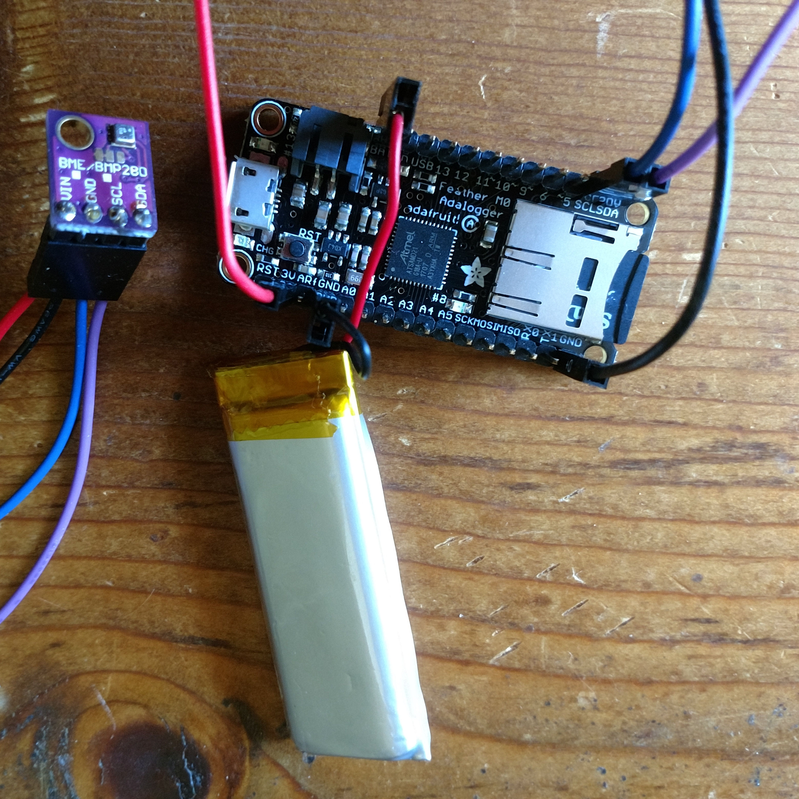

# AdaLogger sketch for BME280 sensor

The [BME280](https://www.bosch-sensortec.com/bst/products/all_products/bme280)
provides temperature, humidity and atmospheric pressure readings.
You can buy a BME280 at
[AdaFruit](https://learn.adafruit.com/adafruit-bme280-humidity-barometric-pressure-temperature-sensor-breakout?view=all)
as well, or [elsewhere](https://www.aliexpress.com/wholesale?SearchText=bme280).
The [AdaLogger](https://learn.adafruit.com/adafruit-feather-m0-adalogger)
provides a Cortex M0 microcontroller with an SD card slot and battery power
management, so that it's possible to make a compact portable data logger.
This projects simply puts them together to write a CSV file on the SD card,
logging the timestamp, battery voltage, temperature, humidity and pressure.
It can be used to monitor your refrigerator, a package in transit, or simply
the weather.

Here's [an example CSV file](example-datalog.csv).

I borrowed (but mostly rewrote) a good bit of code from
[another datalogger](https://github.com/tigoe/DataloggingExamples) so thanks
to Tom Igoe for providing a nice example of SD card logfile writing.

The license is GPLv3 because the [SD library](https://github.com/adafruit/SD)
has that license.  Other Adafruit libraries used here, such as
[the BME280 library](https://github.com/adafruit/Adafruit_BME280_Library),
have the BSD license.  You should set up your Arduino IDE first by installing
the Arduino SAMD and Adafruit SAMD tools as
[described here](https://learn.adafruit.com/adafruit-feather-m0-adalogger/using-with-arduino-ide).

